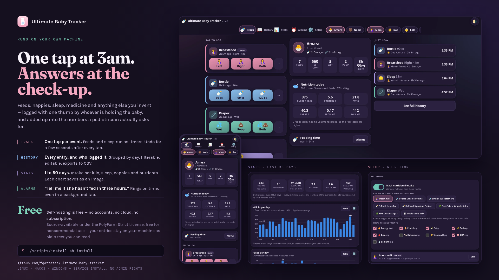

# 🍼 Ultimate Baby Tracker

[](https://fqazzazee.github.io/ultimate-baby-tracker/docs/slide/)

<sub>That slide is a live page, view it here -> (https://fqazzazee.github.io/ultimate-baby-tracker/docs/slide/)

Self-hosted, offline, one-tap tracking for a newborn: feeds, diapers, sleep, baths, medicine, and
anything else you care to invent. Renders and works on modern web browsers from your notebook, 
workstation and phone.


https://github.com/user-attachments/assets/44830829-1585-4d54-80b2-a6cc547ed1d2


No accounts, no cloud, no build step, no dependencies. Your entries stay on your
machine as plain text you can read.

## Install

Node 18 or newer is the only prerequisite.
*(Fedora: `sudo dnf install nodejs` · Debian/Ubuntu: `sudo apt install nodejs` ·
macOS: `brew install node` · Windows: `winget install OpenJS.NodeJS.LTS`)*

### Linux and macOS

```bash
git clone https://github.com/fqazzazee/ultimate-baby-tracker.git
cd ultimate-baby-tracker
./scripts/install.sh install
```

Or without cloning first:

```bash
curl -fsSL https://raw.githubusercontent.com/fqazzazee/ultimate-baby-tracker/main/scripts/install.sh | bash -s -- install
```

On Linux that sets it up as a background service that starts with your machine.
**No `sudo`, no root** — it is a systemd *user* service.

### Windows

```powershell
git clone https://github.com/fqazzazee/ultimate-baby-tracker.git
cd ultimate-baby-tracker
.\scripts\install.cmd install
```

Or without cloning first:

```powershell
& ([scriptblock]::Create((irm https://raw.githubusercontent.com/fqazzazee/ultimate-baby-tracker/main/scripts/install.ps1))) install
```

Runs in the background from the moment you log in. **No administrator rights** —
it registers a scheduled task under your own account, not a system service.

<sub>Use `install.cmd`, not `install.ps1`. Windows blocks unsigned PowerShell
script files by default, so running the `.ps1` directly fails with *"running
scripts is disabled on this system"*. The `.cmd` is a two-line launcher that
passes <code>-ExecutionPolicy&nbsp;Bypass</code> for that one run — it changes
nothing on your machine and still needs no admin. The one-liner above sidesteps
it differently, by never writing a script file at all.</sub>

### Just try it, install nothing

```bash
node server.js     # → http://localhost:8477
```

## Then

The installer prints the address when it is done. Open it on your phone and add
it to the home screen — it behaves like an app from there.

Same three commands on either platform — `install.sh` on Linux and macOS,
`install.cmd` on Windows:

| | |
| --- | --- |
| `status` | where it is installed, and whether it is running |
| `update` | pull the newest version and restart |
| `uninstall` | remove it; add `--purge` / `-Purge` to drop your entries too |

Your entries live outside the application folder and are snapshotted before
every update, so updating cannot touch them.

## What it does

| | |
| --- | --- |
| **Track** | One tap per event. Breastfeeds and sleeps are timers. A toast offers Undo for a few seconds after every tap. |
| **History** | Everything logged, grouped by day, filterable, editable. Exports to CSV. |
| **Stats** | Intake, feeds, diapers, sleep and nutrients over 1–90 days, with the figures a check-up asks for. Each chart downloads as an image. |
| **Alarms** | "Tell me if she hasn't fed in three hours." Rings on time, even in a background tab. |
| **Setup** | Babies, people, which metrics to track, milk profiles, custom buttons, backup and restore. |

Also: multiple babies and multiple carers (every entry records who did it),
optional 4-digit profile PINs, nutrition worked out from the cc you already log,
light and dark themes, and spacing that grows with your system text size.

## Where your data goes

Plain text, on your machine, in one folder you can copy anywhere:

```
config.json    babies, people, buttons, alarms, milk profiles, settings
events.log     one JSON object per line, append-only
timers.json    timers currently running
alarms.json    snooze / last-fired state
```

**Setup → Data** downloads the lot as one compressed file and restores it again.

## Read more

- **[Manual](docs/manual.md)** — every screen, nutrition, statistics, custom
  buttons, backup and restore, the HTTP API
- **[Installing](docs/install.md)** — every installer flag, the service on each
  platform, what an update does
- **[Security](SECURITY.md)** — **read this before exposing it to anything**
- **[Changelog](CHANGELOG.md)**
- **[The slide above](https://fqazzazee.github.io/ultimate-baby-tracker/docs/slide/)** — served live from this
  repository. Edit [`docs/slide/index.html`](docs/slide/index.html) — the copy,
  the colours, the screenshots — then run `node scripts/render-slide.mjs` to
  redraw `docs/slide/slide.png`.

> **No authentication and no encryption.** It was never designed to have any.
> Keep it on a trusted network — see [SECURITY.md](SECURITY.md).

MIT licensed. Made with 🍼 and very little sleep.
